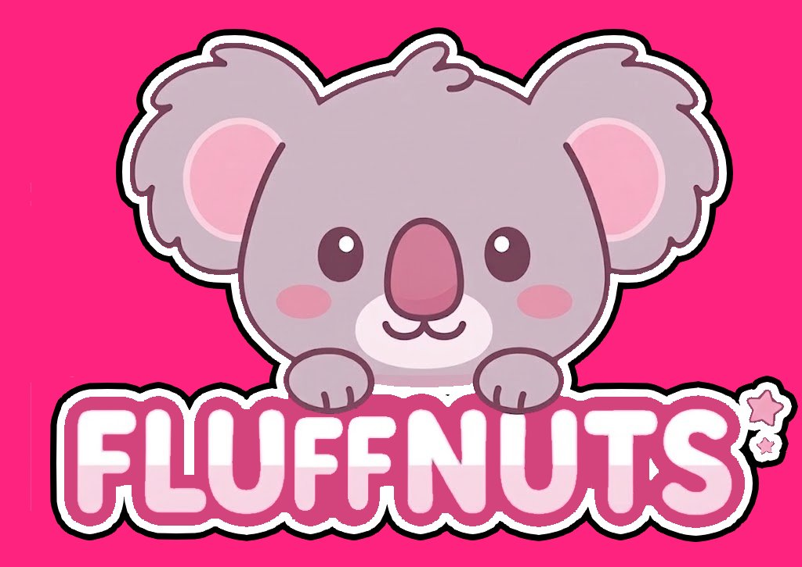

  

# 🐨 Fluffnuts — Floating Vibe Coder

**The cutest pink AI companion for newbie coders.**

Tiny floating window that lives next to VS Code.  
Type a vibe or smash a button → get clean, commented code instantly.

Rebranded from FrameFlame. Now 100% pink + official koala logo.

**Try it live** → Open `index.html` (works offline, feels like a real desktop app)

Built for students, bootcampers & solo builders who just want to ship.

**Star ⭐ if you love fluffy coding!**

Made with love by Left Foot Brake
